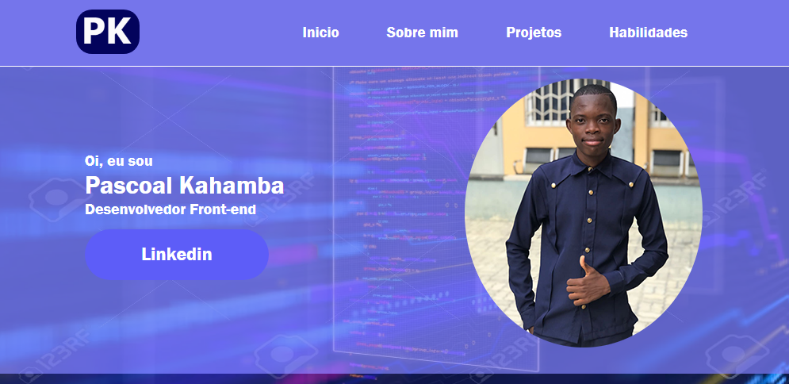
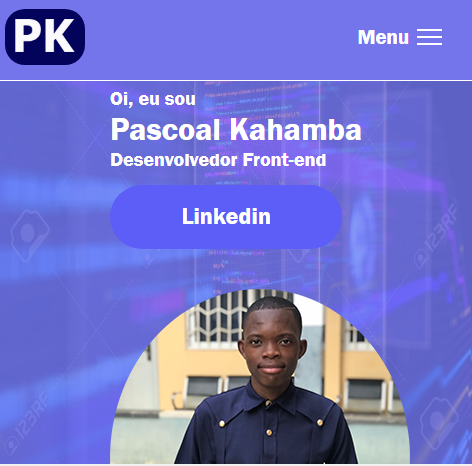

# Portfólio Pascoal Kahamba

Criado com `Javascript` este `site` faz uma breve apresentação sobre mim a minha rotina diaria como programador `front-end`. O site começa claro na pagina inicial onde têm primeiramente o meu `link` para o [Linkedin](https://www.linkedin.com/in/pascoal-kahamba-7b43bb233?lipi=urn%3Ali%3Apage%3Ad_flagship3_profile_view_base_contact_details%3BTg8LEKayToyytOX1pVAQ%2Bg%3D%3D) ao lado uma foto minha na qual passando o cursor sobre ela muda a foto automáticamente e assim que retiras o cursor volta para a foto principal. Depois por baixo vêm novamente uma foto minha e um historial sobre mim, abordo de tudo um pouco a respeito do meu aprendizado na programção.

Mas a diante mostro uns dos projetos que fiz e por ultimo mostro mas minhas habilidades como programador front-end esté `Portfólio` desenvolvi completamente sozinho em busca do meu primeiro `emprego` na ária de desenvolvimento.

`Imagem acessando no telefone`. Basta clicar no `menu` que aparece a `lista de opções`.

## Tecnologias
As seguintes ferramentas foram usadas na constuição deste projeto:

- HTML
- CSS
- JAVASCRIPT

# 
Feito por Pascoal Kahamba meu [Linkedin](https://www.linkedin.com/in/pascoal-kahamba-7b43bb233?lipi=urn%3Ali%3Apage%3Ad_flagship3_profile_view_base_contact_details%3BTg8LEKayToyytOX1pVAQ%2Bg%3D%3D)

😎Este site está em construição.😎💪

[👉Clique aqui se quiseres rodar o projeto na tua maquina!👈](https://meu-portfolio-delta.vercel.app/)😎
